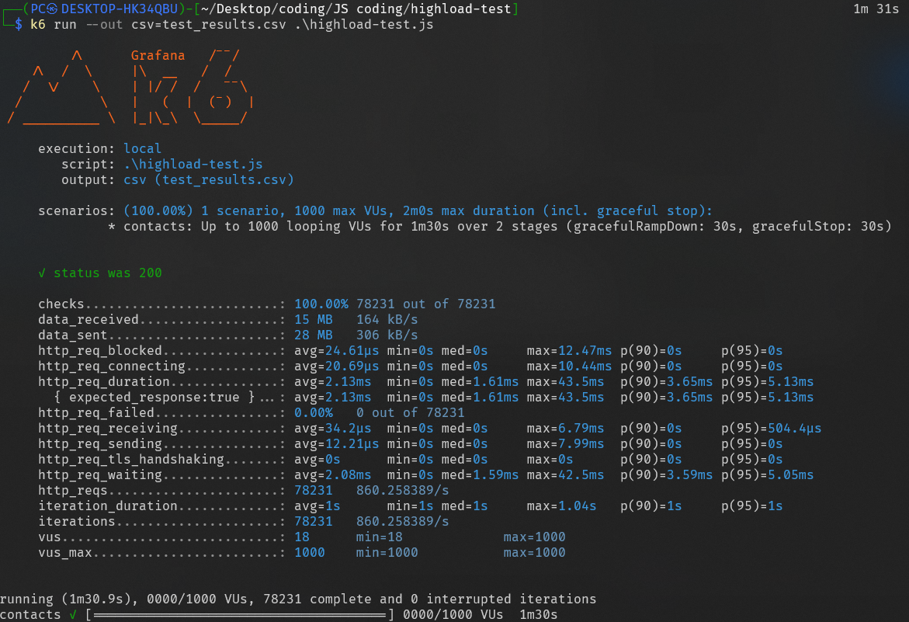
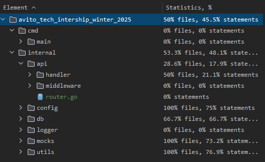

# **Инициализация проекта**
Развертывание проекта осуществляется с помощью Docker и docker-compose. 
База данных PostgreSQL и приложение будут запущены в контейнерах (в базе данных уже лежат данные).
Для этого необходимо выполнить следующие шаги:

1. Склонировать репозиторий:
```bash
git clone https://github.com/Ki4EH/stunning-octo-waddle.git
```
2. Запустить проект:
```bash
docker-compose up
```
После выполнения этих команд проект будет доступен по адресу http://localhost:8080.

# **Вопросы и решение**
## Кеширование
Использование PostgreSQL без дополнительной базы данных Redis. 
Я решил не добавлять Redis для кэширования т.к считаю, что
ввиду ограничение на исользование базы данных в виде Postgres
необходимо пользоваться инструментами которые предоставляет база данных
. Да использование Redis ускорило бы работу с данными, но это было бы не совсем правильно
т.к в данном случае это было бы избыточно, т.к `pgxpool` уже предоставляет кэширование на уровне пула соединений.
Так же можно было дополнительно использовать `PgBouncer`.
Использование `pgxpool` позволило упростить инфраструктуру проекта, снизить задержки при выполнении повторяющихся запросов и сконцентрироваться на оптимизации запросов к PostgreSQL.

- Упростить инфраструктуру проекта
- Снизить задержки при выполнении повторяющихся запросов
- Сконцентрироваться на оптимизации запросов к PostgreSQL

## Использование UUID в качестве ID
Вместо классических автоинкрементируемых идентификаторов был выбран тип UUID по следующим причинам:

- Глобальная уникальность, так же это удобство при масштабировании и миграции данных
- Безопастность ввиду того, что сложнее угадать последовательность ID
- Отсутствие проблем с конкурентной генерацией ID при высокой нагрузке

## Хеширование паролей пользователей
Для повышения безопасности было использваоние хеширование паролей с помощью алгоритма bcrypt.  
Однако, при нагрузочном тестировании возникли проблемы с производительностью.
`bcrypt` оказался слишком медленным, задержка при хешировании достигала **60ms**, что превышало допустимые 50ms согласно требованиям SLI.
Было принято решение отказаться от хеширования паролей, чтобы соответствовать критериям производительности.

## Проблема с производительностью GORM
Изначально для работы с базой данных я использовал ORM-библиотека gorm. 
Однако при нагрузочных тестах стало ясно, что gorm значительно замедляет выполнение запросов

- Медленная инициализация соединений
. Поэтому я отказся от использования gorm в пользу `pgx` и его пула соединений `pgxpool`, что позволило достичь необходимой производительности в 1000 RPS и задержки менее 50ms.

## Трудности с мокированием pgxpool
На этапе написания тестов возникла проблема с мокированием `pgxpool`
. Существующая библиотека поддерживали только `pgxpool` версии `v4`, в то время как я
использовал последнюю доступную версию `v5`. Поэтому по [совету](https://github.com/jackc/pgx/issues/1225) автора библиотеки, мокал интерфейсы через `gomock`, и проверял SQL запросы на базе данных

## Нагрузочное тестирование
Провел нагрузочное тестирование с помощью инструмента k6. Файл сценария находится в папке `k6`,
результаты тестирования можно [посмотреть](https://drive.google.com/file/d/1NmSQUMD0qxzZNR_uu2PAAnp-4kbYzU8S/view?usp=sharing) на Google Drive тк он превышает 100мб .

Показатель RPS - 860s - тк было плавное повышение нагрузки в виде 30с, после минута нагрузки под 1000 RPS, поэтому показатель меньше



## Использование golangci-lint для контроля качества кода и E2E-тестирование
Внедренил правила для предупреждения ошибок и обеспечения читаемости кода
. Для этого использовал golangci-lint и его конфигурацию `.golangci.yml`.
Так же было проведено E2E-тестирование всех бизнес-сценариев с помощью библиотеки `testify` и `testcontainers`.
.Поэтому во время тестов нужно чтобы Docker был открыт

## Покрытие кода тестами
Покрытие кода тестами составило 50%.
Так же для тестов использовал переменные среды, при обычном запуске тестов некоторые тесты могут не проходить

```bash
DATABASE_HOST=host \
DATABASE_NAME=db_name \
DATABASE_PASSWORD=password \
DATABASE_PORT=PORT \
DATABASE_USER=postgres \

go test ./...
```


 